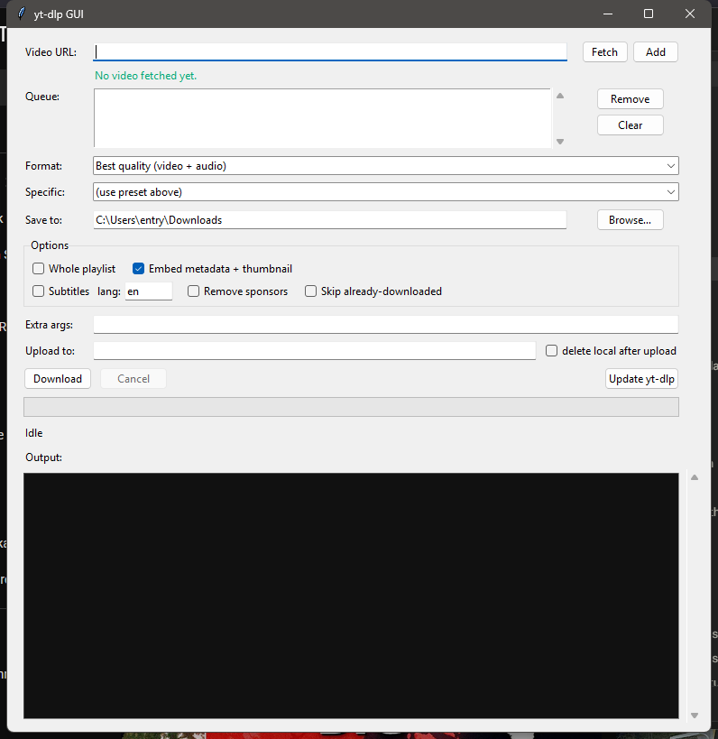

# yt-dlp GUI

A small desktop front-end for [yt-dlp](https://github.com/yt-dlp/yt-dlp). Paste a
URL (or queue up several), pick a quality and a folder, and it runs yt-dlp for you
while showing live progress. It's a single Python file with no third-party
dependencies — just the standard library's `tkinter`.



## Features

- Queue multiple URLs and download them one after another
- Fetch a video's title, duration, channel and real available formats before downloading
- Quality presets (best, 1080p, 720p, 480p, audio-only MP3) or pick a specific format
- Download subtitles in a chosen language (including auto-generated)
- Remove sponsor segments with SponsorBlock
- Keep a download archive so re-running a playlist skips what you already have
- "Extra args" box to pass any yt-dlp flag the UI doesn't expose
- Built-in "Update yt-dlp" button
- Live progress bar with speed/ETA, and a summary of what succeeded or failed
- Remembers your settings between runs

## Requirements

- **Python 3.9+** (uses only the standard library; `tkinter` ships with Python)
- **yt-dlp** — `pip install -U yt-dlp`
- **ffmpeg** on your PATH — needed to merge video+audio and to export MP3
  ([download](https://ffmpeg.org/download.html))

Optional but recommended:

- **[deno](https://deno.com/)** — yt-dlp uses a JavaScript runtime for YouTube
  extraction; without one, some formats may be unavailable. `winget install DenoLand.Deno`
- **[rclone](https://rclone.org/)** — only needed if you want the "Upload to" feature
  (see below). `winget install Rclone.Rclone`

On Windows, the `python` command may be intercepted by the Microsoft Store. If
`python` doesn't work, use the `py` launcher instead (e.g. `py -m pip install -U yt-dlp`).

## Usage

```
python ytdlp_gui.py
```

On Windows you can also just double-click `run.bat`.

1. Paste a video URL.
2. (Optional) Click **Fetch** to load the title and the formats actually available
   for that video, then choose one from the **Specific** dropdown.
3. Click **Add** to queue it, or just hit **Download** to grab the single URL.
4. Pick a folder and any options you want, then **Download**.

### Extra arguments

Anything you type in the **Extra args** box is passed straight to yt-dlp, so you
can reach features the UI doesn't have a control for:

| Example | What it does |
| --- | --- |
| `--limit-rate 2M` | Cap the download speed |
| `--download-sections "*10:00-10:30"` | Download just that clip |
| `--cookies-from-browser chrome` | Use your logged-in browser session |
| `-N 4` | Download fragments in parallel (faster) |

### Uploading to a remote (rclone)

The **Upload to** box lets you send each finished file straight to a cloud or
remote storage backend instead of leaving it on your computer. It uses
[rclone](https://rclone.org/), which supports Google Drive, Dropbox, S3, OneDrive,
SFTP and ~70 other backends.

1. Install rclone (see Requirements) and set up a remote once: `rclone config`.
2. Put the remote and path in the **Upload to** box, e.g. `gdrive:Movies`.
3. Tick **delete local after upload** if you don't want a local copy kept.

Under the hood this adds `--exec "after_move:rclone copy <file> <remote>"` to the
yt-dlp command, so the upload runs automatically once each download finishes.

For a NAS or network share you don't even need rclone — just set the **Save to**
folder to a UNC path like `\\TOWER\media` or a mapped drive.

## How it works

The GUI builds a yt-dlp command from your selections and runs it as a subprocess
(`python -m yt_dlp ...`) — the same thing you'd type in a terminal. Output is read
line by line on a background thread and passed to the UI through a thread-safe
queue, which the main loop drains on a timer. tkinter isn't thread-safe, so the
worker thread never touches widgets directly. The progress bar is driven by parsing
yt-dlp's `[download]  NN.N%` lines.

Settings and the download archive are stored in `%APPDATA%\ytdlp-gui\` on Windows,
or `~/.config/ytdlp-gui/` on macOS/Linux.

## A note on what this is for

yt-dlp does not bypass DRM, and neither does this. Use it for content you're allowed
to download — your own uploads, Creative Commons or public-domain video, or sites
whose terms permit it.

## Roadmap

Things that could be added later:

- "Paste from clipboard" button and clipboard auto-detection on startup
- Per-item status in the queue (queued / downloading / done / failed)
- Thumbnail preview (would require Pillow)
- Packaging as a standalone `.exe` with PyInstaller

## License

MIT — see [LICENSE](LICENSE).
