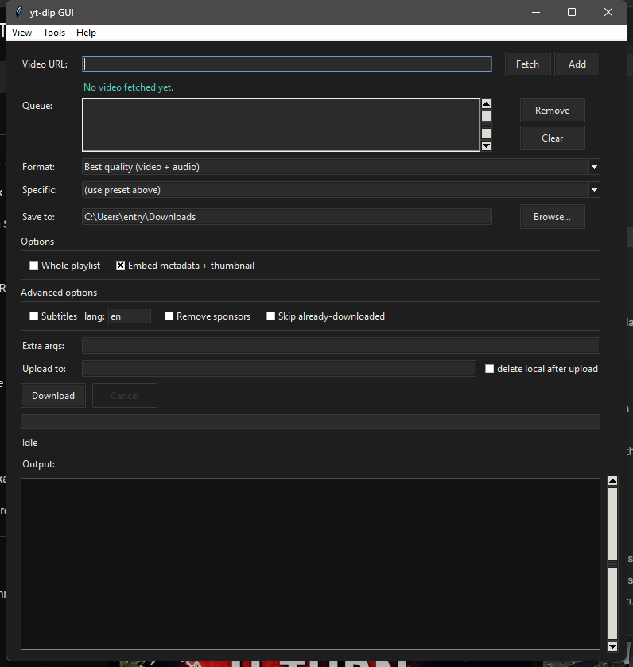
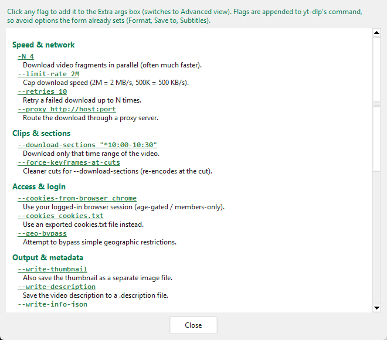

# yt-dlp GUI

[](LICENSE)


A small desktop front-end for [yt-dlp](https://github.com/yt-dlp/yt-dlp). Paste a
URL (or queue up several), pick a quality and a folder, and it runs yt-dlp for you
while showing live progress. It's a single Python file with no third-party
dependencies — just the standard library's `tkinter`.




*Simple view (light) and Advanced view (dark). Switch views, toggle the theme, and
open Help from the menu bar — your choices are remembered.*

## Download

A prebuilt Windows `.exe` (no Python install needed) is available on the
[Releases page](https://github.com/swissmayfield/ytdlp-gui/releases). It bundles
yt-dlp, so it works out of the box — you only need **ffmpeg** on your PATH for
merging video+audio and MP3 export.

**macOS / Linux:** run from source (see Requirements below) or build your own
binary with `python build.py`.

## Features

- Queue multiple URLs and download them one after another
- Fetch a video's title, duration, channel and real available formats before downloading
- Quality presets (best, 1080p, 720p, 480p, audio-only MP3) or pick a specific format
- Download subtitles in a chosen language (including auto-generated)
- Remove sponsor segments with SponsorBlock
- Keep a download archive so re-running a playlist skips what you already have
- "Extra args" box to pass any yt-dlp flag the UI doesn't expose
- Built-in "Update yt-dlp" button
- Live progress bar with speed/ETA, and a summary of what succeeded or failed
- Simple / Advanced views to hide or show the power-user options
- Menu bar with in-app Help, plus Tools (update yt-dlp, open download/settings folders)
- Built-in glossary of useful yt-dlp flags — click one to insert it into Extra args
- Light and dark themes, toggled in-app
- Remembers your settings between runs

## Requirements

- **Python 3.9+** with **tkinter** (included on Windows and the python.org macOS
  installer; on Linux install `python3-tk` separately — see below)
- **yt-dlp** — `pip install -U yt-dlp`
- **ffmpeg** on your PATH — needed to merge video+audio and to export MP3
  ([download](https://ffmpeg.org/download.html))

Optional but recommended:

- **[deno](https://deno.com/)** — yt-dlp uses a JavaScript runtime for YouTube
  extraction; without one, some formats may be unavailable.
- **[rclone](https://rclone.org/)** — only needed for the "Upload to" feature.

### Per-OS setup

**Windows** — install [Python](https://www.python.org/) (tkinter included) and
[ffmpeg](https://ffmpeg.org/download.html), then `py -m pip install -U yt-dlp`.
If `python` opens the Microsoft Store, use the `py` launcher instead. Optional
tools: `winget install DenoLand.Deno Rclone.Rclone`.

**macOS** (Homebrew):
```
brew install python-tk ffmpeg
pip3 install -U yt-dlp
```

**Linux** (Debian/Ubuntu):
```
sudo apt install python3-tk ffmpeg
pip install -U yt-dlp
```

## Usage

```
python ytdlp_gui.py
```

On Windows you can double-click `run.bat`; on Linux/macOS run `./run.sh`.

1. Paste a video URL.
2. (Optional) Click **Fetch** to load the title and the formats actually available
   for that video, then choose one from the **Specific** dropdown.
3. Click **Add** to queue it, or just hit **Download** to grab the single URL.
4. Pick a folder and any options you want, then **Download**.

Use the **View** menu to switch between Simple and Advanced, toggle Dark mode, or
find **Help** for a quick how-to and the extra-args glossary.

### Extra arguments

Anything you type in the **Extra args** box is passed straight to yt-dlp, so you
can reach features the UI doesn't have a control for:

| Example | What it does |
| --- | --- |
| `--limit-rate 2M` | Cap the download speed |
| `--download-sections "*10:00-10:30"` | Download just that clip |
| `--cookies-from-browser chrome` | Use your logged-in browser session |
| `-N 4` | Download fragments in parallel (faster) |

The built-in **Help → Extra-args glossary** lists many more, grouped by purpose —
click any flag to drop it straight into the Extra args box.



### Uploading to a remote (rclone)

The **Upload to** box lets you send each finished file straight to a cloud or
remote storage backend instead of leaving it on your computer. It uses
[rclone](https://rclone.org/), which supports Google Drive, Dropbox, S3, OneDrive,
SFTP and ~70 other backends.

1. Install rclone (see Requirements) and set up a remote once: `rclone config`.
2. Put the remote and path in the **Upload to** box, e.g. `gdrive:Movies`.
3. Tick **delete local after upload** if you don't want a local copy kept.

Under the hood this adds `--exec "after_move:rclone copy <file> <remote>"` to the
yt-dlp command, so the upload runs automatically once each download finishes.

For a NAS or network share you don't even need rclone — just set the **Save to**
folder to a UNC path like `\\TOWER\media` or a mapped drive.

## How it works

The GUI builds a yt-dlp command from your selections and runs it as a subprocess
(`python -m yt_dlp ...`) — the same thing you'd type in a terminal. Output is read
line by line on a background thread and passed to the UI through a thread-safe
queue, which the main loop drains on a timer. tkinter isn't thread-safe, so the
worker thread never touches widgets directly. The progress bar is driven by parsing
yt-dlp's `[download]  NN.N%` lines.

Settings and the download archive are stored in `%APPDATA%\ytdlp-gui\` on Windows,
or `~/.config/ytdlp-gui/` on macOS/Linux.

When packaged with PyInstaller, `sys.executable` is the GUI exe rather than a
Python interpreter, so the app calls a bundled (or PATH) `yt-dlp.exe` instead of
`python -m yt_dlp`. See `ytdlp_base()`.

## Building a standalone binary

```
pip install -U pyinstaller
python build.py
```

`build.py` downloads the pinned yt-dlp binary for the current OS, verifies its
SHA-256 against the hash published by the yt-dlp project (aborting on mismatch),
bundles it, and runs PyInstaller. The result is `dist/ytdlp-gui.exe` on Windows
or `dist/ytdlp-gui` on macOS/Linux. PyInstaller can't cross-compile, so run it on
each OS you want a binary for.

## A note on what this is for

yt-dlp does not bypass DRM, and neither does this. Use it for content you're allowed
to download — your own uploads, Creative Commons or public-domain video, or sites
whose terms permit it.

## Roadmap

Things that could be added later:

- "Paste from clipboard" button and clipboard auto-detection on startup
- Per-item status in the queue (queued / downloading / done / failed)
- Thumbnail preview (would require Pillow)
- Packaging as a standalone `.exe` with PyInstaller

## Security notes

- External tools are always invoked with argument **lists**, never a shell
  string (`shell=True` is never used).
- The rclone **Upload to** value is validated (`name:path`, no shell
  metacharacters) before use, because yt-dlp runs `--exec` through the shell.
- "Open … folder" only ever opens an existing directory, so a stray path can't
  be executed via `os.startfile`.
- The bundled `yt-dlp.exe` is **pinned and SHA-256-verified** at build time
  (`build.py`).
- yt-dlp does not bypass DRM; use only for content you're allowed to download.

## License

MIT — see [LICENSE](LICENSE).
